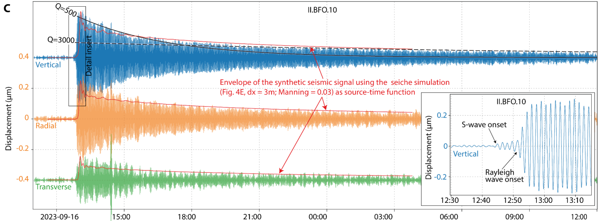

# Introduction à Python et Obspy : Geophysique GEOLF309
## Bienvenue sur le GitHub adressé aux étudiant.e.S inscrits au cours de GEOLF309 à l'Université libre de Bruxelles.

Le notebook **Intro2Python-student** permet aux étudiant.e.s de se familiariser ou de se rafraichir la mémoire concernant les fonctionnalités python. Ce notebook passe en revue aussi bien comment modifier un notebook (et Markdown) mais également les fonctions de bases de python (loop, enumerate, ...).

Le notebook **Intro2Obspy-student** est plus spécifique et s'intéresse principalement à l'utilisation de la bibliothèque Obspy. Dans se notebook, les étudiant.e.s apprendront comment importer un fichier .miniSEED mais également comment importer une trace sismique depuis une base de données. Ils apprendront également quelques traitement de bases du signal comme le filtre. L'apprentissage se focalisera principalement au travers d'un exemple ; du Tsunami généré par un glissement de terrain au Groenland (Svennevig et al 2024).

